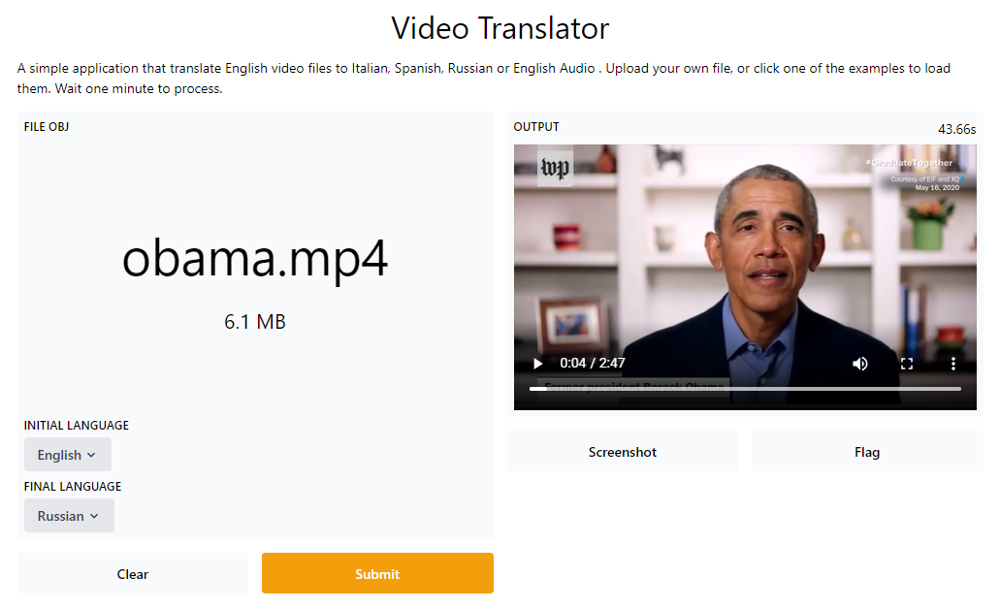

# Video Translator using Gradio



Convert video files into spoken video using google text to speech package and building a user-friendly ready-made interface using [Gradio package](https://www.gradio.app/). 

## Installation

Fork or clone the repo and run 

```bash
pip install -r requirements.txt
```

## Usage

Follow a step-by-step guide tutorial in my blog [ruslanmv.com]( ruslanmv.com)

## Contributing

Pull requests are welcome. For major changes, please open an issue first to discuss what you would like to change.

Please make sure to update tests as appropriate.

## License

[MIT](https://choosealicense.com/licenses/mit/)

